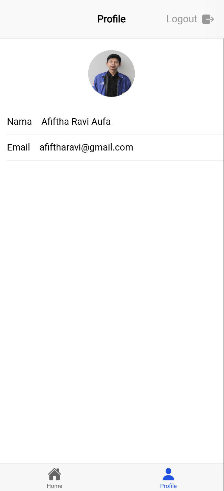

```
Nama: Afiftha Ravi Aufa Yubiharto
NIM: H1D022095
Shift Baru: A
Shift Lama: A
```
# Tugas 9 dan 10 Praktikum Pemrograman Mobile
## Router

Aplikasi memiliki 4 route utama:

- `/`: Redirect ke `/login`.
- `/login`: Hanya dapat diakses jika **belum login** (`isAuth: false`).
- `/home` dan `/profile`: Hanya dapat diakses jika **sudah login** (`isAuth: true`).

Implementasi router-nya:

```ts
const routes: Array<RouteRecordRaw> = [
  { path: "/", redirect: "/login" },
  {
    path: "/login",
    name: "login",
    component: LoginPage,
    meta: { isAuth: false },
  },
  {
    path: "/home",
    name: "home",
    component: HomePage,
    meta: { isAuth: true },
  },
  {
    path: "/profile",
    name: "profile",
    component: ProfilePage,
    meta: { isAuth: true },
  },
];
```

## Login

Login menggunakan **GoogleAuth** dari Firebase. Setelah berhasil, user akan diarahkan ke halaman `/home`.

Kode login:

```ts
const loginWithGoogle = async () => {
  try {
    await GoogleAuth.initialize({
      clientId: "9737*******************",
      scopes: ["profile", "email"],
      grantOfflineAccess: true,
    });
    const googleUser = await GoogleAuth.signIn();
    const idToken = googleUser.authentication.idToken;

    const credential = GoogleAuthProvider.credential(idToken);
    const result = await signInWithCredential(auth, credential);

    user.value = result.user;
    router.push("/home");
  } catch (error) {
    console.error("Google sign-in error:", error);
    throw error;
  }
};
```

Komponen tampilan login di `LoginPage.vue`:

```html
<template>
  <ion-page>
    <ion-content :fullscreen="true">
      <div id="container">
        <ion-text>
          <h1>Praktikum Pemrograman Mobile</h1>
        </ion-text>
        <ion-button @click="login" color="light">
          <ion-icon slot="start" :icon="logoGoogle"></ion-icon>
          <ion-label>Sign In with Google</ion-label>
        </ion-button>
      </div>
    </ion-content>
  </ion-page>
</template>

<script setup lang="ts">
import { IonContent, IonPage, IonButton, IonIcon, IonText, IonLabel } from "@ionic/vue";
import { logoGoogle } from "ionicons/icons";
import { useAuthStore } from "@/stores/auth";

const authStore = useAuthStore();

const login = async () => {
  await authStore.loginWithGoogle();
};
</script>
```

## Home dan Profile

Setelah login berhasil, user diarahkan ke halaman **home**. Foto profil, nama, dan email dapat dilihat di halaman **profilePage**.

```ts
const authStore = useAuthStore();
const user = computed(() => authStore.user);
```

## Logout

Logout dilakukan dengan:

1. Sign out dari Google.
2. Reset state user.
3. Redirect ke `/login`.

Kode logout:

```ts
const logout = async () => {
  try {
    await GoogleAuth.signOut();
    await signOut(auth);
    user.value = null;
    router.replace("/login");
  } catch (error) {
    console.error("Sign-out error:", error);
    throw error;
  }
};
```
<p align="center">
   &nbsp;&nbsp;&nbsp;
  
</p>

## Tugas 10

### 1. Home
**Hame* menampilkan daftar tugas yang aktif dan selesai, dirender menggunakan `src\views\HomePage.vue`. Data tugas diambil dari Firebase.

#### Model Data
Tipe data `Todo` didefinisikan dalam `firestore.ts`:

```ts
export interface Todo {
  id?: string;
  title: string;
  description: string;
  status: boolean; // true = selesai, false = aktif
  createdAt: Date;
  updatedAt: Date;
}
```

#### Memuat Data Tugas
Fungsi `loadTodos` digunakan untuk mengambil data secara asinkron dengan indikator loading.

```ts
const loadTodos = async (isLoading = true) => {
  try {
    if (isLoading) {
      const loading = await loadingController.create({ message: "Loading..." });
      await loading.present();
    }
    todos.value = await firestoreService.getTodos();
  } catch (error) {
    console.error(error);
  } finally {
    loading?.dismiss();
  }
};
```

#### Mengambil Data Tugas
Data tugas diambil dari Firebase dan diurutkan berdasarkan `updatedAt` secara descending.

```ts
async getTodos(): Promise<Todo[]> {
  const q = query(this.getTodoRef(), orderBy("updatedAt", "desc"));
  const snapshot = await getDocs(q);
  return snapshot.docs.map(
    (doc) => ({ id: doc.id, ...doc.data() } as Todo)
  );
}
```

---

### 2. Tambah dan Ubah Tugas
Tugas dapat ditambahkan atau diubah melalui modal form.

#### UI Modal
Form digunakan untuk menangani penambahan dan pengeditan tugas.

```html
<ion-input v-model="todo.title" placeholder="Masukkan Judul"></ion-input>
<ion-textarea v-model="todo.description" placeholder="Masukkan Deskripsi"></ion-textarea>
<ion-button @click="input">{{ editingId ? "Ubah" : "Tambah" }} Todo</ion-button>
```

#### Proses Submit
Fungsi `handleSubmit` memvalidasi input, membedakan proses tambah dan ubah, serta memperbarui UI.

```ts
const handleSubmit = async (todo: Omit<Todo, "id" | "createdAt" | "updatedAt" | "status">) => {
  if (!todo.title) return showToast("Judul harus diisi", "warning");

  try {
    if (editingId.value) {
      await firestoreService.updateTodo(editingId.value, todo as Todo);
      showToast("Tugas berhasil diubah", "success");
    } else {
      await firestoreService.addTodo(todo as Todo);
      showToast("Tugas berhasil ditambahkan", "success");
    }
    loadTodos();
  } catch (error) {
    console.error(error);
    showToast("Terjadi kesalahan", "danger");
  } finally {
    editingId.value = null;
  }
};
```

#### Integrasi Firebase
- **Tambah Tugas**: Menambahkan tugas baru ke Firestore.

```ts
async addTodo(todo: Omit<Todo, "id">) {
  const docRef = await addDoc(this.getTodoRef(), {
    ...todo,
    status: false,
    createdAt: Timestamp.now(),
    updatedAt: Timestamp.now(),
  });
  return docRef.id;
}
```

- **Ubah Tugas**: Mengubah tugas berdasarkan ID.

```ts
async updateTodo(id: string, todo: Partial<Todo>) {
  const docRef = doc(this.getTodoRef(), id);
  await updateDoc(docRef, { ...todo, updatedAt: Timestamp.now() });
}
```

---

### 3. Ubah Status Tugas
Status tugas dapat diubah menjadi selesai atau aktif dengan menggeser dan mengetuk ikon status.

#### Fungsi Ubah Status
Ikon status memicu fungsi `handleStatus`.

```ts
const handleStatus = async (statusTodo: Todo) => {
  try {
    await firestoreService.updateStatus(statusTodo.id!, !statusTodo.status);
    showToast(`Tugas ditandai sebagai ${!statusTodo.status ? "selesai" : "aktif"}`, "success");
    loadTodos();
  } catch (error) {
    console.error(error);
    showToast("Gagal memperbarui status", "danger");
  }
};
```

---

### 4. Hapus Tugas
Tugas dapat dihapus dengan menggeser ke kanan atau menekan tombol hapus.

#### Fungsi Hapus Tugas
Fungsi `handleDelete` digunakan untuk menghapus tugas.

```ts
const handleDelete = async (deleteTodo: Todo) => {
  try {
    await firestoreService.deleteTodo(deleteTodo.id!);
    showToast("Tugas berhasil dihapus", "success");
    loadTodos();
  } catch (error) {
    console.error(error);
    showToast("Gagal menghapus tugas", "danger");
  }
};
```

#### Integrasi Firebase
Menghapus tugas berdasarkan ID dari Firestore.

```ts
async deleteTodo(id: string) {
  const docRef = doc(this.getTodoRef(), id);
  await deleteDoc(docRef);
}
```

---

