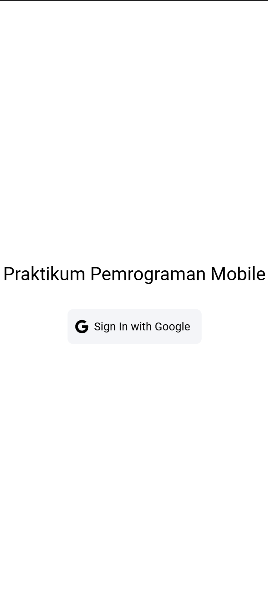

```
Nama: Afiftha Ravi Aufa Yubiharto
NIM: H1D022095
Shift Baru: A
Shift Lama: A
```

## Router

Aplikasi memiliki 4 route utama:

- `/`: Redirect ke `/login`.
- `/login`: Hanya dapat diakses jika **belum login** (`isAuth: false`).
- `/home` dan `/profile`: Hanya dapat diakses jika **sudah login** (`isAuth: true`).

Implementasi router-nya:

```ts
const routes: Array<RouteRecordRaw> = [
  { path: "/", redirect: "/login" },
  {
    path: "/login",
    name: "login",
    component: LoginPage,
    meta: { isAuth: false },
  },
  {
    path: "/home",
    name: "home",
    component: HomePage,
    meta: { isAuth: true },
  },
  {
    path: "/profile",
    name: "profile",
    component: ProfilePage,
    meta: { isAuth: true },
  },
];
```

## Login

Login menggunakan **GoogleAuth** dari Firebase. Setelah berhasil, user akan diarahkan ke halaman `/home`.

Kode login:

```ts
const loginWithGoogle = async () => {
  try {
    await GoogleAuth.initialize({
      clientId: "9737*******************",
      scopes: ["profile", "email"],
      grantOfflineAccess: true,
    });
    const googleUser = await GoogleAuth.signIn();
    const idToken = googleUser.authentication.idToken;

    const credential = GoogleAuthProvider.credential(idToken);
    const result = await signInWithCredential(auth, credential);

    user.value = result.user;
    router.push("/home");
  } catch (error) {
    console.error("Google sign-in error:", error);
    throw error;
  }
};
```

Komponen tampilan login di `LoginPage.vue`:

```html
<template>
  <ion-page>
    <ion-content :fullscreen="true">
      <div id="container">
        <ion-text>
          <h1>Praktikum Pemrograman Mobile</h1>
        </ion-text>
        <ion-button @click="login" color="light">
          <ion-icon slot="start" :icon="logoGoogle"></ion-icon>
          <ion-label>Sign In with Google</ion-label>
        </ion-button>
      </div>
    </ion-content>
  </ion-page>
</template>

<script setup lang="ts">
import { IonContent, IonPage, IonButton, IonIcon, IonText, IonLabel } from "@ionic/vue";
import { logoGoogle } from "ionicons/icons";
import { useAuthStore } from "@/stores/auth";

const authStore = useAuthStore();

const login = async () => {
  await authStore.loginWithGoogle();
};
</script>
```

## Home dan Profile

Setelah login berhasil, user diarahkan ke halaman **home**. Foto profil, nama, dan email dapat dilihat di halaman **profilePage**.

```ts
const authStore = useAuthStore();
const user = computed(() => authStore.user);
```

## Logout

Logout dilakukan dengan:

1. Sign out dari Google.
2. Reset state user.
3. Redirect ke `/login`.

Kode logout:

```ts
const logout = async () => {
  try {
    await GoogleAuth.signOut();
    await signOut(auth);
    user.value = null;
    router.replace("/login");
  } catch (error) {
    console.error("Sign-out error:", error);
    throw error;
  }
};
```
<p align="center">
   &nbsp;&nbsp;&nbsp;
  
</p>


